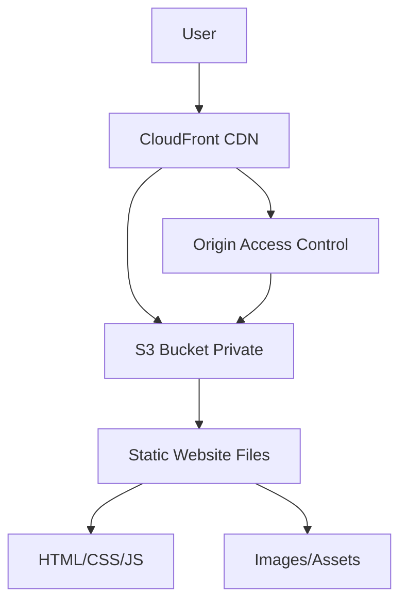

# Felix Projects Portfolio

A comprehensive portfolio website showcasing web development projects and professional resume, built with modern web technologies and deployed on AWS.

## 🏗️ Architecture Overview



## 📁 Project Structure

```
FelixProjects/
├── resume/
│   └── resume.md              # Resume content template
├── images/
│   ├── profile.png            # Professional headshot
│   ├── certifications/        # Certification badges
│   └── README.md             # Image guidelines
├── AdviWeather/              # Weather application
├── CurrencyFlipper/          # Currency converter
├── RecipeFinder/             # Recipe search app
├── NewYearCountDown/         # Countdown timer
├── calculator/               # Calculator app
├── AnalogueClock/           # Canvas clock
├── AgeCalculator/           # Age calculation tool
├── PassengerCounter/        # Counter application
├── resume.html              # Professional resume page
├── resume-styles.css        # Resume styling
├── deploy-resume.sh         # AWS deployment script
├── update-resume.sh         # Update script
└── index.html              # Main portfolio page
```

## 🚀 Quick Start

### 1. Local Development
```bash
# Clone or navigate to project directory
cd FelixProjects

# Open resume.html in browser to preview
open resume.html
```

### 2. Customize Resume
Edit `resume/resume.md` with your information:
- Contact details
- Skills and experience
- Projects and achievements
- Certifications and education

### 3. Add Your Images
- Add profile photo as `felix.png` (or update HTML reference)
- Add certification badges to `images/certifications/`

### 4. Deploy to AWS
```bash
# Make sure AWS CLI is configured
aws configure

# Deploy with security best practices
./deploy-resume.sh
```

## 🔒 Security Features

- **Private S3 Bucket**: No public access, secured with bucket policies
- **Origin Access Control (OAC)**: Modern replacement for OAI
- **HTTPS Enforcement**: All traffic redirected to HTTPS
- **Restricted Policies**: CloudFront-only access to S3
- **Security Headers**: Proper caching and security configurations

## 💰 Cost Breakdown

| Service | Monthly Cost |
|---------|-------------|
| S3 Storage (1GB) | ~$0.02 |
| CloudFront (1GB transfer) | ~$0.09 |
| CloudFront Requests (10K) | ~$0.01 |
| **Total Estimated** | **< $0.25/month** |

## 🛠️ Technologies Used

### Frontend
- **HTML5**: Semantic markup and accessibility
- **CSS3**: Modern styling with Flexbox/Grid
- **JavaScript**: Interactive functionality
- **Responsive Design**: Mobile-first approach

### Backend/Infrastructure
- **AWS S3**: Static website hosting
- **AWS CloudFront**: Global CDN distribution
- **AWS CLI**: Deployment automation
- **Bash Scripts**: Deployment and update automation

### Development Tools
- **Git**: Version control
- **VS Code**: Development environment
- **Browser DevTools**: Testing and debugging

## 📱 Responsive Design

The resume website is fully responsive across all devices:

- **Mobile**: 320px and up
- **Tablet**: 768px and up  
- **Desktop**: 1024px and up
- **Print**: Optimized print styles

## 🔄 Update Workflow

### Making Changes
1. Edit `resume.html` or `resume-styles.css`
2. Test locally in browser
3. Run update script:
```bash
./update-resume.sh
```

### Adding New Projects
1. Create project folder with HTML/CSS/JS
2. Add project link to main `index.html`
3. Update resume with new project details

## 🚀 Deployment Process

### Initial Deployment
```bash
./deploy-resume.sh
```

This script:
1. Creates private S3 bucket with security settings
2. Uploads website files with proper content types
3. Creates CloudFront distribution with OAC
4. Configures bucket policies for CloudFront access
5. Waits for deployment completion
6. Provides website URL and deployment info

### Updates
```bash
./update-resume.sh
```

This script:
1. Uploads changed files to S3
2. Invalidates CloudFront cache
3. Confirms deployment status

## 🔧 Troubleshooting

### Common Issues

**AWS CLI not configured**
```bash
aws configure
# Enter your AWS Access Key ID, Secret, Region, and output format
```

**Permission denied on scripts**
```bash
chmod +x deploy-resume.sh update-resume.sh
```

**CloudFront deployment taking long**
- Initial deployments can take 5-15 minutes
- Check AWS Console for deployment status

**Website not updating**
- Run `./update-resume.sh` to invalidate cache
- Wait 1-3 minutes for changes to propagate

### Verification Steps

1. **Check S3 bucket**: Files uploaded correctly
2. **Check CloudFront**: Distribution status "Deployed"
3. **Test website**: Open provided URL in browser
4. **Test mobile**: Use browser dev tools mobile view

## 🎯 Best Practices Implemented

### Security
- Private S3 bucket with blocked public access
- Origin Access Control instead of legacy OAI
- HTTPS enforcement and security headers
- Restricted IAM policies

### Performance
- CloudFront CDN for global delivery
- Optimized caching strategies
- Compressed assets and modern formats
- Efficient CSS and JavaScript

### Accessibility
- Semantic HTML structure
- Proper heading hierarchy
- Alt text for images
- Keyboard navigation support
- High contrast colors

### SEO
- Meta tags and descriptions
- Structured data markup
- Fast loading times
- Mobile-friendly design

## 📈 Future Enhancements

### Potential Additions
- Custom domain with Route 53
- Contact form with AWS SES
- Blog section with static site generator
- Analytics with CloudWatch
- Multi-language support
- Dark mode toggle

### Advanced Features
- CI/CD pipeline with GitHub Actions
- Automated testing and validation
- Performance monitoring
- A/B testing capabilities

## 📞 Support

For issues or questions:
1. Check troubleshooting section above
2. Review AWS CloudFormation/CLI documentation
3. Check AWS service status page
4. Review deployment logs in terminal

## 📄 License

This project is open source and available under the MIT License.

---

**Built with ❤️ using modern web technologies and AWS cloud services**